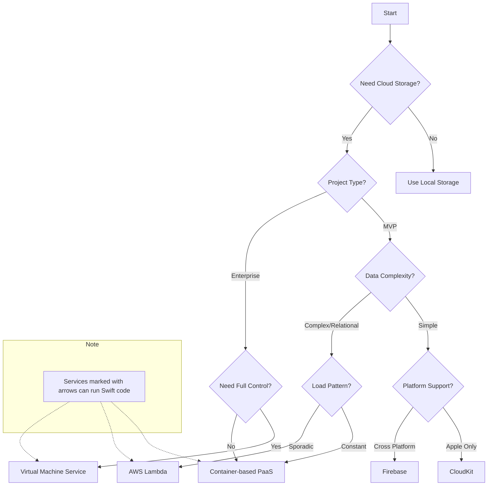

# iOS Backend Selection Guide

**Created by [BrightDigit](https://brightdigit.com)**

## Table of Contents

- [Decision Tree](#decision-tree)
- [Do You Need a Backend?](#do-you-need-a-backend)
- [Backend Options Overview](#backend-options-overview)
  - [Local Storage](#local-storage)
  - [CloudKit](#cloudkit)
  - [Firebase](#firebase)
  - [AWS Lambda](#aws-lambda)
  - [Container-based PaaS](#container-based-paas-heroku-flyio-etc)
  - [Virtual Machine Services](#virtual-machine-services)
- [Swift on the Server Options](#swift-on-the-server-options)
- [Technical Considerations](#technical-considerations)
- [Deployment Considerations](#deployment-considerations)
- [Cost Considerations](#cost-considerations)
- [About BrightDigit](#about-brightdigit)
- [Further Reading](#further-reading)
- [License](#license)

## Decision Tree

## Do You Need a Backend?
Consider local storage first if:
- Data is private/sensitive
- You're using third-party APIs (YouTube, etc.)
- You only need local device storage with Core Data
- Data backup can be handled through manual file exports

## Backend Options Overview

### Local Storage
**Best for:**
- Private/sensitive data
- Offline-first applications
- Simple data structures
- Individual device usage

### [CloudKit](https://developer.apple.com/icloud/cloudkit/)
**Best for:**
- Apple-only ecosystem
- Native iOS development
- Push notification requirements
- Client app transfers
- Simple data structures

### [Firebase](https://firebase.google.com)
**Best for:**
- Cross-platform development
- Real-time database needs
- Simple query requirements
- Quick MVP development
- Limited backend maintenance

### [AWS Lambda](https://aws.amazon.com/lambda/)
**Best for:**
- Sporadic workloads
- Pay-per-use pricing
- Event-driven processing
- Swift serverless (only platform supporting Swift natively)
- APIs with intermittent traffic

### Container-based PaaS (Heroku, Fly.io, etc.)
**Best for:**
- Constant workloads
- Relational databases
- Traditional web applications
- Better cloud provider portability
- Fixed monthly costs

**Popular Options:**
- [Heroku](https://www.heroku.com)
- [Fly.io](https://fly.io)
- [Railway](https://railway.app)
- [Render](https://render.com)
- [Digital Ocean App Platform](https://www.digitalocean.com/products/app-platform)
- [Google Cloud Run](https://cloud.google.com/run)
- [Platform.sh](https://platform.sh)

### Virtual Machine Services
**Best for:**
- Maximum control
- Custom infrastructure requirements
- Complex networking needs
- Specific compliance requirements
- Legacy system support

**Popular Options:**
- [AWS EC2](https://aws.amazon.com/ec2/)
- [Azure Virtual Machines](https://azure.microsoft.com/products/virtual-machines)
- [Google Compute Engine](https://cloud.google.com/compute)
- [DigitalOcean Droplets](https://www.digitalocean.com/products/droplets)
- [Linode](https://www.linode.com)
- [Vultr](https://www.vultr.com)

## Swift on the Server Options

Swift can be used as a server-side language in multiple deployment scenarios:

### Framework Options
- [Vapor](https://vapor.codes)
- [Hummingbird](https://github.com/hummingbird-project/hummingbird)
- [SwiftNIO](https://github.com/apple/swift-nio) (for building custom frameworks)

### Deployment Options
- Virtual Machine Services (run Swift directly on Linux)
- Container-based PaaS (using [Docker](https://www.docker.com) containers)
- [AWS Lambda _supports Swift_](https://github.com/swift-server/swift-aws-lambda-runtime)
- [Heroku](https://www.heroku.com) (supports Swift buildpacks)

## Technical Considerations

### Data Complexity
**Simple Data Needs:**
- Key-value storage
- Document storage
- Basic CRUD operations
- No complex relationships

**Complex Data Needs:**
- Relational data
- Complex queries
- Transaction requirements
- Data consistency requirements

### Database Options
- [PostgreSQL](https://www.postgresql.org) - Popular open-source relational database
- [MySQL](https://www.mysql.com) - Open-source relational database
- [MongoDB](https://www.mongodb.com) - Document-based NoSQL database
- [Redis](https://redis.io) - In-memory data structure store
- [Amazon DynamoDB](https://aws.amazon.com/dynamodb/) - NoSQL key-value database
- [Amazon Aurora](https://aws.amazon.com/rds/aurora/) - Cloud-native relational database

### Load Patterns
**Sporadic:**
- Irregular usage
- Long idle periods
- Burst traffic
- Development/testing

**Constant:**
- Steady traffic
- Predictable load
- 24/7 operation
- Regular usage patterns

## Deployment Considerations
- Consider infrastructure as code from the start
- Plan for monitoring and logging
- Consider backup and disaster recovery
- Think about scaling strategy
- Plan for security from the beginning

## Cost Considerations
- Serverless: Pay per use, good for variable loads
- Containers: Fixed costs, better for constant loads
- VMs: Most control, highest maintenance overhead
- Factor in developer time and expertise
- Consider future scaling costs

## About BrightDigit

### Expert in Swift App Development

Founded in 2012, [BrightDigit](https://brightdigit.com) specializes in Swift and Apple platform development. We believe platform-native development delivers the best user experience, bringing deep technical expertise to help companies build exceptional apps for iOS, watchOS, and the entire Apple ecosystem.

### How We Can Help

From initial concept to complex development challenges, our team provides end-to-end support including:
- Swift app development for all Apple platforms (iOS, watchOS, tvOS, macOS)
- Swift on the server with Vapor, Hummingbird, and AWS Lambda serverless functions
- Platform porting and Android to iOS app conversions
- API development and third-party integrations
- UI/UX design optimized for Apple's Human Interface Guidelines
- Backend architecture selection and implementation

📧 [Contact us for a consultation](https://brightdigit.com/contact)
📰 [Subscribe to our newsletter](https://brightdigit.com/newsletter) for iOS development tips
🎧 [Listen to our podcast](https://brightdigit.com/podcast) featuring iOS industry experts

## Further Reading

### Official Documentation
- [Swift AWS Lambda Runtime Documentation](https://github.com/swift-server/swift-aws-lambda-runtime)
- [Apple CloudKit Documentation](https://developer.apple.com/icloud/cloudkit/)
- [Firebase Documentation](https://firebase.google.com/docs)

### BrightDigit Resources

**Featured Articles & Podcast Episodes:**
- 📖 **[Choosing the Best Backend for your iOS App](https://brightdigit.com/articles/best-backend-for-your-ios-app/)** - Comprehensive guide to backend selection
- 🎙️ **[Swift Server Side Serverless with Sébastien Stormacq](https://brightdigit.com/episodes/191-swift-server-side-serverless-with-sebastien-stormacq/)** - Deep dive into AWS Lambda with Swift
- 🎙️ **[Backend Decisions with Mikaela Caron](https://brightdigit.com/episodes/127-backend-decisions-with-mikaela-caron/)** - Real-world backend selection strategies

### Community Resources
- [Server-Side Swift](https://swift.org/server/) - Official Swift server resources
- [Vapor Discord](https://discord.gg/vapor) - Active community for Swift backend developers

---

## License

This work is licensed under a [Creative Commons Attribution-ShareAlike 4.0 International License](https://creativecommons.org/licenses/by-sa/4.0/).

This means you are free to:
- **Share** — copy and redistribute the material in any medium or format
- **Adapt** — remix, transform, and build upon the material for any purpose, even commercially

Under the following terms:
- **Attribution** — You must give appropriate credit to BrightDigit, provide a link to the license, and indicate if changes were made
- **ShareAlike** — If you remix, transform, or build upon the material, you must distribute your contributions under the same license as the original
- **Link Back** — Any use must include a link back to this original repository

## Copyright

© 2025 BrightDigit, LLC. All rights reserved.

For questions about licensing or usage, contact Leo at [leo@brightdigit.com](mailto:leo@brightdigit.com)

---

Made with ❤️ by [BrightDigit](https://brightdigit.com)

[Subscribe to our Newsletter](https://brightdigit.com/newsletter) • [Listen to our Podcast](https://www.empowerapps.show)
