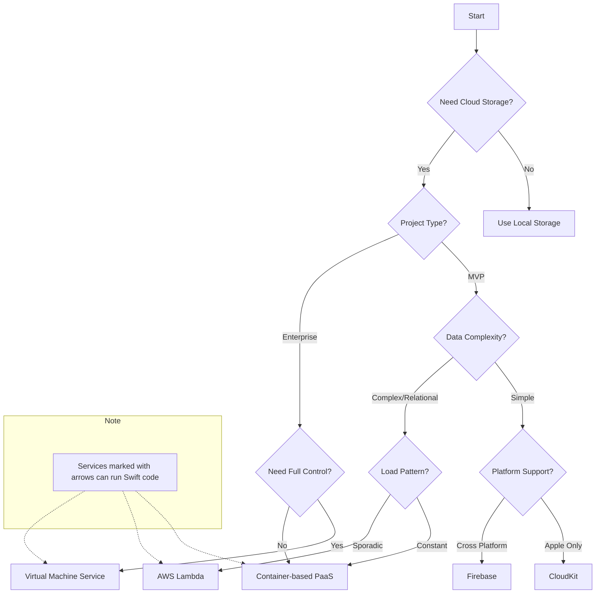

# iOS Backend Selection Guide

## Decision Tree

## Do You Need a Backend?
Consider local storage first if:
- Data is private/sensitive
- You're using third-party APIs (YouTube, etc.)
- You only need local device storage with Core Data
- Data backup can be handled through manual file exports

## Backend Options Overview

### Local Storage
**Best for:**
- Private/sensitive data
- Offline-first applications
- Simple data structures
- Individual device usage

### [CloudKit](https://developer.apple.com/icloud/cloudkit/)
**Best for:**
- Apple-only ecosystem
- Native iOS development
- Push notification requirements
- Client app transfers
- Simple data structures

### [Firebase](https://firebase.google.com)
**Best for:**
- Cross-platform development
- Real-time database needs
- Simple query requirements
- Quick MVP development
- Limited backend maintenance

### [AWS Lambda](https://aws.amazon.com/lambda/)
**Best for:**
- Sporadic workloads
- Pay-per-use pricing
- Event-driven processing
- Swift serverless (only platform supporting Swift natively)
- APIs with intermittent traffic

### Container-based PaaS (Heroku, Fly.io, etc.)
**Best for:**
- Constant workloads
- Relational databases
- Traditional web applications
- Better cloud provider portability
- Fixed monthly costs

**Popular Options:**
- [Heroku](https://www.heroku.com)
- [Fly.io](https://fly.io)
- [Railway](https://railway.app)
- [Render](https://render.com)
- [Digital Ocean App Platform](https://www.digitalocean.com/products/app-platform)
- [Google Cloud Run](https://cloud.google.com/run)
- [Platform.sh](https://platform.sh)

### Virtual Machine Services
**Best for:**
- Maximum control
- Custom infrastructure requirements
- Complex networking needs
- Specific compliance requirements
- Legacy system support

**Popular Options:**
- [AWS EC2](https://aws.amazon.com/ec2/)
- [Azure Virtual Machines](https://azure.microsoft.com/products/virtual-machines)
- [Google Compute Engine](https://cloud.google.com/compute)
- [DigitalOcean Droplets](https://www.digitalocean.com/products/droplets)
- [Linode](https://www.linode.com)
- [Vultr](https://www.vultr.com)

## Swift on the Server Options

Swift can be used as a server-side language in multiple deployment scenarios:

### Framework Options
- [Vapor](https://vapor.codes)
- [Hummingbird](https://github.com/hummingbird-project/hummingbird)
- [SwiftNIO](https://github.com/apple/swift-nio) (for building custom frameworks)

### Deployment Options
- Virtual Machine Services (run Swift directly on Linux)
- Container-based PaaS (using [Docker](https://www.docker.com) containers)
- [AWS Lambda](https://aws.amazon.com/lambda/) (native Swift support)
- [Heroku](https://www.heroku.com) (supports Swift buildpacks)

## Technical Considerations

### Data Complexity
**Simple Data Needs:**
- Key-value storage
- Document storage
- Basic CRUD operations
- No complex relationships

**Complex Data Needs:**
- Relational data
- Complex queries
- Transaction requirements
- Data consistency requirements

### Database Options
- [PostgreSQL](https://www.postgresql.org) - Popular open-source relational database
- [MySQL](https://www.mysql.com) - Open-source relational database
- [MongoDB](https://www.mongodb.com) - Document-based NoSQL database
- [Redis](https://redis.io) - In-memory data structure store
- [Amazon DynamoDB](https://aws.amazon.com/dynamodb/) - NoSQL key-value database
- [Amazon Aurora](https://aws.amazon.com/rds/aurora/) - Cloud-native relational database

### Load Patterns
**Sporadic:**
- Irregular usage
- Long idle periods
- Burst traffic
- Development/testing

**Constant:**
- Steady traffic
- Predictable load
- 24/7 operation
- Regular usage patterns

## Deployment Considerations
- Consider infrastructure as code from the start
- Plan for monitoring and logging
- Consider backup and disaster recovery
- Think about scaling strategy
- Plan for security from the beginning

## Cost Considerations
- Serverless: Pay per use, good for variable loads
- Containers: Fixed costs, better for constant loads
- VMs: Most control, highest maintenance overhead
- Factor in developer time and expertise
- Consider future scaling costs

## Further Reading

### Official Documentation
- [Swift AWS Lambda Runtime Documentation](https://github.com/swift-server/swift-aws-lambda-runtime)
- [Apple CloudKit Documentation](https://developer.apple.com/icloud/cloudkit/)
- [Firebase Documentation](https://firebase.google.com/docs)

### Related Articles and Episodes
- [Choosing the Best Backend for your iOS App](https://brightdigit.com/articles/best-backend-for-your-ios-app/)
- [Swift Server Side Serverless with Sébastien Stormacq](https://brightdigit.com/episodes/191-swift-server-side-serverless-with-sebastien-stormacq/)
- [Backend Decisions with Mikaela Caron](https://brightdigit.com/episodes/127-backend-decisions-with-mikaela-caron/)
